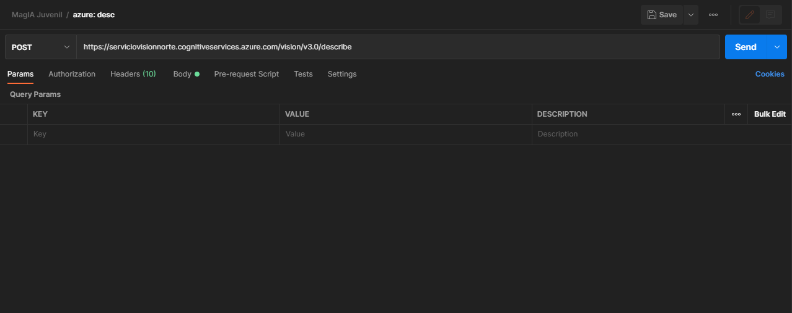
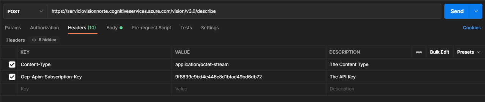
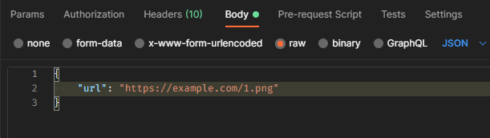
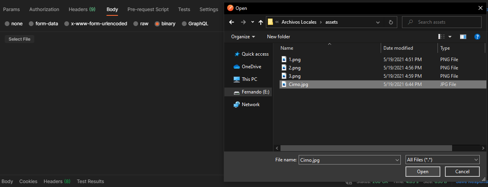
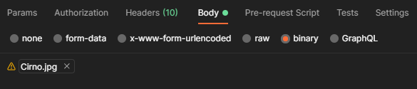
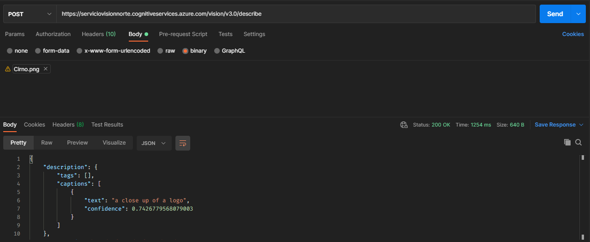
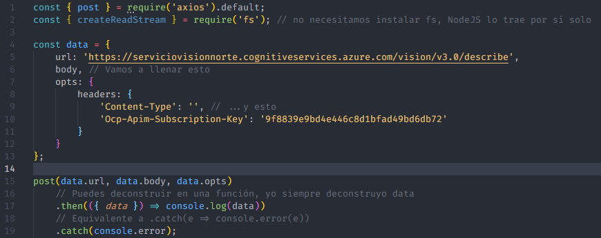

# Cómo utilizar archivos locales para los Servicios Cognitivos 

## En Postman
Crea una nueva petición, y usa algún endpoint que involucre la subida de imágenes. Yo voy a usar  
```https://serviciovisionnorte.cognitiveservices.azure.com/vision/v3.0/describe```  
Recuerda llenar datos adicionales como el header `Ocp-Apim-Subscription-Key`
  

Dirígete a **Headers**, y añade el header `Content-Type`. En clases pasadas, se ha estado usando el valor de `application/json`, pero para utilizar archivos locales tendremos que utilizar `application/octet-stream`.
  

Ahora dirígete a **Body**. Normalmente utilizaríamos un tipo `raw` de formato `JSON`, como esto:  
  

Sin embargo, para usar archivos locales utilizamos un `binary`. Seleccionamos el tipo, y al hacerlo aparecerá un botón llamado **Select File**, hacemos click y seleccionamos el archivo con el selector que se nos proporciona. Yo voy a usar [esta imagen de Cirno](assets/Cirno.png).
  
Al seleccionarla, aparecerá su nombre.  
  

Ahora puedes enviar la petición sin problema!
  
- - -
## En Node (JavaScript)

### Filesystem
Antes de empezar, es importante mentionar el módulo predeterminado de Node `fs`, o Filesystem ([documentación](https://nodejs.org/api/fs.html)).  
Este módulo provee varias funcionalidades relacionadas con archivos.  
Una de estas funcionalidades es `fs.createReadStream()`, ésta crea un Stream binario que se puede utilizar para los APIs.
- - -
Primero, debemos tener instalado el módulo `axios` para realizar las peticiones. Empecemos con un código base.  
  
Ahora, llenamos los datos.  
En `data.body`, creamos un Stream. Usamos `createReadStrean('./path/to/file.png')`, donde la ruta es un [Path](https://nodejs.org/api/path.html). En mi caso, utilizo:
```js
createReadStream('./assets/Cirno.png')
```  

En `data.opts.headers['Content-Type']`, ponemos `'application/octet-stream'`.  

Nuestro código resultante: 
```js
const { post } = require('axios').default;
const { createReadStream } = require('fs');

const data = {
    url: 'https://serviciovisionnorte.cognitiveservices.azure.com/vision/v3.0/describe',
    body: createReadStream('./assets/Cirno.png'),
    opts: {
        headers: {
            'Content-Type': 'application/octet-stream',
            'Ocp-Apim-Subscription-Key': '9f8839e9bd4e446c8d1bfad49bd6db72'
        }
    }
};

post(data.url, data.body, data.opts)
    .then(({ data }) => console.log(data))
    .catch(console.error);
```
Corre el archivo con `node archivo.js`, y saldrá un objeto con los datos regresados. De ahí puedes hacer magia como accesar `data.description.captions[0].text` (el resultado de la detección).  

Puedes revisar el código comentado y  en [peticion.js](peticion.js)  

Si tienes una pregunta, me puedes contactar en Teams.  
Espero esto ayude!
- - -
Fernando González, 2021